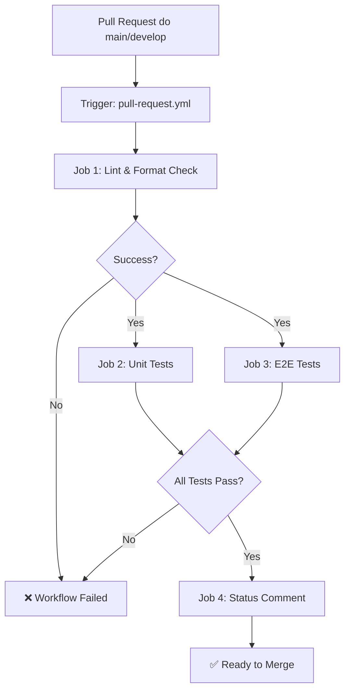

# Lekcja: CI/CD w Praktyce - Od Teorii do Implementacji

## 📚 Spis Treści

1. [Czym jest CI/CD?](#czym-jest-cicd)
2. [Nasz Workflow - Anatomia](#nasz-workflow---anatomia)
3. [Narzędzia i Technologie](#narzędzia-i-technologie)
4. [Dobre Praktyki CI/CD](#dobre-praktyki-cicd)
5. [Bezpieczeństwo w CI/CD](#bezpieczeństwo-w-cicd)
6. [Optymalizacja i Performance](#optymalizacja-i-performance)
7. [Troubleshooting i Debugging](#troubleshooting-i-debugging)
8. [Zaawansowane Techniki](#zaawansowane-techniki)

---

## Czym jest CI/CD?

### Definicje

**CI (Continuous Integration)** - Ciągła Integracja
- Praktyka, w której deweloperzy regularnie mergują swój kod do głównej gałęzi
- Każdy merge jest automatycznie weryfikowany poprzez automatyczne buildy i testy
- Cel: Wykryć problemy wcześnie, gdy są łatwiejsze do naprawienia

**CD (Continuous Delivery/Deployment)** - Ciągłe Dostarczanie/Wdrażanie
- Continuous Delivery: Kod jest zawsze w stanie gotowym do wdrożenia
- Continuous Deployment: Każda zmiana automatycznie trafia na produkcję (po testach)

### Dlaczego CI/CD?

#### ❌ Bez CI/CD:
```
Developer A pracuje 2 tygodnie → PR → Conflicts!
Developer B pracuje 2 tygodnie → PR → Tests fail!
Developer C pracuje 2 tygodnie → PR → Style issues!

Merge Hell → 3 dni naprawiania konfliktów
Production Deploy → Bug discovered!
Rollback → 2 godziny downtime
```

#### ✅ Z CI/CD:
```
Developer A: commit → auto tests → instant feedback → fix → commit
Developer B: commit → auto tests → instant feedback → fix → commit
Developer C: commit → auto tests → instant feedback → fix → commit

PR → All checks passed → Merge
Deploy → Automated, tested, confident
Issue? → Rollback w sekundy
```

### Korzyści CI/CD

1. **Szybsze wykrywanie błędów** - Problemy wykrywane w minutach, nie w dniach
2. **Lepsza jakość kodu** - Automatyczne sprawdzanie standardów
3. **Mniejsze ryzyko** - Małe, częste zmiany zamiast wielkich, ryzykownych release'ów
4. **Szybsze dostarczanie** - Od commita do produkcji w godziny, nie w tygodnie
5. **Lepsze bezpieczeństwo** - Automatyczne sprawdzanie podatności
6. **Dokumentacja** - Historia wszystkich zmian i testów

---

## Nasz Workflow - Anatomia

### Struktura Pipeline



### Krok po Kroku

#### 1. Trigger - Kiedy uruchamiamy workflow?

```yaml
on:
  pull_request:
    branches: [main, develop]
```

**Co to robi?**
- Workflow uruchamia się przy każdym Pull Requeście do `main` lub `develop`
- NIE uruchamia się przy commitach bezpośrednio do brancha
- NIE uruchamia się przy draft PR (chyba że zmienisz na `ready_for_review`)

**Dlaczego to ważne?**
- Weryfikujemy kod PRZED mergem, nie po
- Chronimy główne branche przed złym kodem
- Deweloper dostaje feedback PRZED review od ludzi

#### 2. Concurrency - Anulowanie starych uruchomień

```yaml
concurrency:
  group: ${{ github.workflow }}-${{ github.ref }}
  cancel-in-progress: true
```

**Co to robi?**
- Jeśli pushjesz nowy commit do PR, stare uruchomienie jest anulowane
- Oszczędza zasoby GitHub Actions
- Szybsze feedback (nie czekasz na stary build)

**Przykład:**
```
10:00 - Push commit A → Workflow starts
10:05 - Push commit B → Workflow A canceled, Workflow B starts
10:10 - Push commit C → Workflow B canceled, Workflow C starts
```

**Bez concurrency:**
- Wszystkie 3 workflow działają równolegle
- Marnowanie zasobów (60 minut → 180 minut)
- Wolniejsze działanie (runner może być zajęty)

---

## Narzędzia i Technologie

### 1. GitHub Actions - Orchestrator

#### Czym jest?
- CI/CD platforma wbudowana w GitHub
- Uruchamia "jobs" w kontenerach Docker na serwerach GitHub
- 2000 minut/miesiąc gratis dla repozytoriów prywatnych
- Nielimitowane dla publicznych

#### Alternatywy:
- **Jenkins** - Self-hosted, bardzo konfigurowalna, ale wymaga utrzymania
- **GitLab CI** - Podobna do GitHub Actions, wbudowana w GitLab
- **CircleCI** - SaaS, dobra dla małych projektów
- **Travis CI** - Starsza, mniej popularna
- **Azure Pipelines** - Microsoft, integracja z Azure
- **Bitbucket Pipelines** - Atlassian, integracja z Jira

#### Dlaczego GitHub Actions?
✅ Wbudowana w GitHub (nie trzeba konfigurować)
✅ Dobre darmowe limity
✅ Łatwa konfiguracja YAML
✅ Duża społeczność (marketplace actions)
✅ Dobre do małych/średnich projektów

❌ Droga dla dużych projektów (self-hosted alternatywa)
❌ Vendor lock-in (migracja do Jenkins = przepisanie wszystkiego)

### 2. ESLint & Prettier - Code Quality

#### ESLint - Linter

**Co to robi?**
```javascript
// ❌ ESLint wykryje problem
function calculate() {
  var result = 5;  // var zamiast const/let
  if (result = 10) { // = zamiast ===
    return result
  }  // brak średnika
}

// ✅ Po ESLint --fix
function calculate() {
  const result = 5;
  if (result === 10) {
    return result;
  }
}
```

**Rodzaje błędów wykrywanych przez ESLint:**
1. **Syntax errors** - Błędy składni
2. **Bad practices** - Złe praktyki (unused vars, var zamiast const)
3. **Security issues** - Potencjalne luki (eval, innerHTML)
4. **Performance issues** - Nieoptymalne konstrukcje

#### Prettier - Code Formatter

**Co to robi?**
```javascript
// ❌ Przed Prettier
const user={name:"John",age:30,email:"john@example.com"}
function  greet(  user  ){return `Hello ${user.name}`}

// ✅ Po Prettier
const user = {
  name: "John",
  age: 30,
  email: "john@example.com",
};

function greet(user) {
  return `Hello ${user.name}`;
}
```

**Dlaczego rozdzielamy linting i formatting?**
- **ESLint** = jakość kodu (logika, błędy)
- **Prettier** = styl kodu (formatowanie)
- Prettier jest szybszy i bardziej opinionated
- ESLint może mieć konfliktujące reguły stylowania

### 3. Vitest - Unit Testing Framework

#### Czym jest?
- Framework do testowania jednostkowego dla Vite/Astro
- Szybszy od Jest (native ESM support)
- Kompatybilny z API Jest (łatwa migracja)

#### Co testujemy?

**Unit Tests = Małe, izolowane kawałki kodu**

```typescript
// sm2.ts - Algorytm SuperMemo 2
export function calculateNextReview(
  quality: number,
  repetitions: number,
  easiness: number,
  interval: number
): ReviewResult {
  // ... logika ...
}

// sm2.test.ts
describe('SM2 Algorithm', () => {
  it('should increase interval for quality >= 3', () => {
    const result = calculateNextReview(4, 0, 2.5, 1);
    expect(result.interval).toBeGreaterThan(1);
  });
  
  it('should reset repetitions for quality < 3', () => {
    const result = calculateNextReview(2, 5, 2.5, 10);
    expect(result.repetitions).toBe(0);
  });
});
```

**Co osiągamy?**
1. **Pewność** - Wiemy że funkcja działa poprawnie
2. **Regression prevention** - Zmiana nie zepsuje istniejącej funkcjonalności
3. **Dokumentacja** - Testy pokazują jak używać funkcji
4. **Refactoring confidence** - Możesz zmieniać kod bez strachu

#### Coverage - Co to jest?

**Coverage = Jak dużo kodu jest pokryte testami**

```typescript
// Przykład funkcji
function divide(a: number, b: number): number {
  if (b === 0) {  // Line 1
    throw new Error('Division by zero');  // Line 2
  }
  return a / b;  // Line 3
}

// Test 1
test('divide 10 by 2', () => {
  expect(divide(10, 2)).toBe(5);
});
// Coverage: 66% (Line 1, 3) - Line 2 nie jest testowane!

// Test 2
test('divide by zero throws', () => {
  expect(() => divide(10, 0)).toThrow();
});
// Coverage: 100% - Wszystkie linie testowane!
```

**Rodzaje coverage:**
- **Line Coverage** - % linii wykonanych
- **Branch Coverage** - % ścieżek if/else wykonanych
- **Function Coverage** - % funkcji wywołanych
- **Statement Coverage** - % instrukcji wykonanych

**Nasz config:**
```typescript
coverage: {
  provider: "v8",  // Szybki, native w Node.js
  reporter: ["text", "json", "html", "lcov"],
  reportsDirectory: "./coverage",
  include: ["src/**/*.{ts,tsx}"],  // Co testujemy
  exclude: [
    "src/**/*.d.ts",  // Definicje typów - nie ma logiki
    "src/**/*.test.{ts,tsx}",  // Same testy
    "src/**/__tests__/**",  // Folder z testami
    "src/env.d.ts",  // Konfiguracja
    "src/db/database.types.ts",  // Wygenerowane typy
  ],
}
```

**Jaki coverage jest dobry?**
- 80%+ = Dobry start
- 90%+ = Bardzo dobry
- 100% = Nice to have, ale nie zawsze potrzebne

**Czego NIE mierzysz coveragem:**
❌ Jakości testów (można mieć 100% coverage z głupimi testami)
❌ Czy wszystkie edge cases są pokryte
❌ Czy testy są sensowne

### 4. Playwright - E2E Testing

#### Czym jest?
- Framework do testowania end-to-end (symulacja użytkownika)
- Wspiera Chrome, Firefox, Safari, Edge
- Headless lub headed mode
- Automatyczne czekanie na elementy

#### Różnica: Unit vs E2E

**Unit Test:**
```typescript
// Testujesz izolowaną funkcję
test('login function validates email', () => {
  expect(validateEmail('invalid')).toBe(false);
  expect(validateEmail('test@example.com')).toBe(true);
});
```

**E2E Test:**
```typescript
// Testujesz cały flow jak użytkownik
test('user can login', async ({ page }) => {
  await page.goto('/login');
  await page.fill('[name=email]', 'test@example.com');
  await page.fill('[name=password]', 'password123');
  await page.click('button[type=submit]');
  await expect(page).toHaveURL('/dashboard');
});
```

#### Co testujemy w E2E?

**Critical User Paths = Najważniejsze ścieżki użytkownika**

```typescript
// 1. Autentykacja
test('user can register, login, logout');

// 2. Core functionality
test('user can create flashcard set');
test('user can add flashcards');
test('user can study flashcards');

// 3. Critical business logic
test('user can purchase subscription');
test('payment flow works end-to-end');
```

**Czego NIE testujemy w E2E?**
❌ Edge cases (to dla unit testów)
❌ Wszystkich kombinacji (za wolne, drogie)
❌ UI details (kolor buttona, padding)

**E2E w CI/CD:**
```yaml
- name: Install Playwright browsers (Chromium)
  run: npx playwright install --with-deps chromium
```

**Dlaczego tylko Chromium?**
- ✅ Szybsze (1 przeglądarka = mniej czasu)
- ✅ Tańsze (mniej minut GitHub Actions)
- ✅ 90%+ użytkowników używa Chrome/Edge (Chromium)
- ✅ Wystarczy do weryfikacji funkcjonalności

**Kiedy testować wszystkie przeglądarki?**
- Lokalnie przed release
- W scheduled workflow (np. nightly)
- Jeśli masz specyficzne wymagania (Safari dla iOS, Firefox dla enterprise)

#### Playwright w CI - Problemy i Rozwiązania

**Problem 1: Testy są flaky (niestabilne)**
```typescript
// ❌ Zły test - race condition
await page.click('button');
expect(page.locator('.result')).toBeVisible();
// Może nie zdążyć się załadować!

// ✅ Dobry test - czeka automatycznie
await page.click('button');
await expect(page.locator('.result')).toBeVisible();
// Playwright czeka do 30s na element
```

**Problem 2: Wolne w CI**
```yaml
# ❌ Wolne - instaluje wszystkie przeglądarki
npx playwright install --with-deps

# ✅ Szybkie - tylko Chromium
npx playwright install --with-deps chromium
```

**Problem 3: Timeouts**
```typescript
// playwright.config.ts
export default defineConfig({
  timeout: 30 * 1000,  // 30s per test
  expect: {
    timeout: 5000,  // 5s per assertion
  },
  retries: 2,  // Retry flaky tests
});
```

### 5. Codecov - Coverage Tracking

#### Czym jest?
- SaaS do śledzenia code coverage w czasie
- Pokazuje trendy (coverage rośnie/maleje)
- Integracja z PR (komentarze z coverage diff)
- Wykresy i raporty

#### Jak to działa?

```yaml
- name: Upload unit test coverage to Codecov
  uses: codecov/codecov-action@v4
  with:
    files: ./coverage/lcov.info  # Plik z coverage
    flags: unit-tests  # Tag dla tego uploadu
    token: ${{ secrets.CODECOV_TOKEN }}
```

**Co daje Codecov?**

1. **PR Comments:**
```markdown
## Codecov Report
Coverage increased by 2.5% (85.2% → 87.7%)

Files changed:
- src/lib/sm2.ts: 80% → 100% ✅
- src/lib/auth.ts: 60% → 55% ⚠️

Overall: ✅ Coverage increased
```

2. **Dashboard:**
- Wykresy coverage w czasie
- Coverage per file/directory
- Trending (czy coverage rośnie?)
- Sunburst chart (wizualizacja struktury)

3. **Branch Protection:**
```yaml
# GitHub Settings
require_status_checks:
  - codecov/project  # Fail jeśli coverage spada
  - codecov/patch    # Fail jeśli nowy kod ma < X% coverage
```

**Alternatywy:**
- **Coveralls** - Podobne do Codecov
- **SonarQube** - Bardziej kompleksowe (quality + coverage + security)
- **CodeClimate** - Code quality + coverage

---

## Dobre Praktyki CI/CD

### 1. Fast Feedback Loop

**Principle: Im szybciej, tym lepiej**

```yaml
# ✅ Dobra kolejność
1. Lint (1-2 min) → Fast fail na style issues
2. Unit Tests (2-5 min) → Fast fail na logic errors
3. E2E Tests (5-10 min) → Wolniejsze, ale krytyczne
4. Build (5-10 min) → Tylko jeśli testy przeszły
5. Deploy → Tylko jeśli build przeszedł
```

**Dlaczego?**
- Deweloper dostaje feedback w 2 minuty (lint), nie w 20 (po build)
- Oszczędność zasobów (nie buildujemy jeśli lint fail)
- Lepsza produktywność (szybka iteracja)

### 2. Parallelization - Równoległe Uruchamianie

```yaml
# ✅ Równolegle - szybciej
unit-test:
  needs: [lint]  # Start after lint
  
e2e-test:
  needs: [lint]  # Start after lint (parallel with unit-test)

# ❌ Sekwencyjnie - wolniej
unit-test:
  needs: [lint]
  
e2e-test:
  needs: [unit-test]  # Wait for unit-test (slower!)
```

**Timing:**
```
Sequential: Lint(2m) → Unit(5m) → E2E(10m) = 17 minut
Parallel:   Lint(2m) → [Unit(5m) + E2E(10m)] = 12 minut
                        ^-- równolegle --^
```

### 3. Fail Fast - Szybkie Wykrywanie Błędów

```yaml
# ✅ Fail fast
- name: Run ESLint
  run: npm run lint
  # Jeśli fail, stop workflow (nie uruchamiaj testów)

# ❌ Continue on error
- name: Run ESLint
  run: npm run lint
  continue-on-error: true  # Zły pomysł!
  # Testy uruchomią się nawet jeśli lint fail
```

**Wyjątki - kiedy używać `continue-on-error`?**
```yaml
# ✅ OK dla opcjonalnych kroków
- name: Upload to Codecov
  uses: codecov/codecov-action@v4
  continue-on-error: true  # OK - nie blokuj jeśli Codecov down
```

### 4. Immutable Builds - Niezmienne Buildy

**Problem:**
```yaml
# ❌ Zły build
- run: npm install  # Może pobrać nowsze wersje!
# package.json: "react": "^18.0.0"
# Dzisiaj: instaluje 18.2.0
# Za miesiąc: instaluje 18.3.0 (breaking change!)
```

**Rozwiązanie:**
```yaml
# ✅ Dobry build
- run: npm ci  # Używa dokładnych wersji z package-lock.json
# Zawsze ta sama wersja = przewidywalne buildy
```

**npm install vs npm ci:**
- `npm install`: Aktualizuje package-lock.json, może instalować nowsze wersje
- `npm ci`: Usuwa node_modules, instaluje z package-lock.json, szybsze, dla CI

### 5. Environment Parity - Spójność Środowisk

**Principle: Dev = CI = Staging = Production**

```yaml
# ✅ Dobra konfiguracja
- name: Setup Node.js
  uses: actions/setup-node@v4
  with:
    node-version: '20'  # Ta sama wersja jak lokalnie
```

**Dockerfile dla pełnej parity:**
```dockerfile
FROM node:20-alpine
WORKDIR /app
COPY package*.json ./
RUN npm ci
COPY . .
RUN npm run build

# Ten sam container lokalnie, w CI, na produkcji
```

### 6. Test Data Management

**Problem: E2E potrzebuje danych**

```typescript
// ❌ Zły test - używa danych produkcyjnych
test('user can login', async ({ page }) => {
  await page.fill('[name=email]', 'real.user@company.com');
  await page.fill('[name=password]', 'production-password');
  // Co jeśli ktoś zmieni hasło?
});

// ✅ Dobry test - używa dedykowanych danych testowych
test('user can login', async ({ page }) => {
  const email = process.env.E2E_USERNAME;  // test@example.com
  const password = process.env.E2E_PASSWORD;  // test-password
  await page.fill('[name=email]', email);
  await page.fill('[name=password]', password);
});
```

**Best practices dla test data:**
1. **Dedykowany test user** - Nie używaj produkcyjnych kont
2. **Sekrety w GitHub Secrets** - Nie commituj credentials
3. **Cleanup po testach** - Usuń utworzone dane
4. **Idempotent tests** - Test może być uruchomiony wiele razy

### 7. Secrets Management

**Hierarchia sekretów:**
```
Repository Secrets - Dostępne dla całego repo
   ↓
Environment Secrets - Specyficzne dla środowiska (production, staging)
   ↓
Organization Secrets - Dzielone między repozytoria
```

**Nasz przykład:**
```yaml
e2e-test:
  environment: integration  # Używa sekretów z env "integration"
  steps:
    - run: |
        echo "PUBLIC_SUPABASE_URL=${{ secrets.PUBLIC_SUPABASE_URL }}" >> .env.test
        # Sekret nigdy nie jest wyświetlany w logach (****)
```

**Best practices:**
1. **Never commit secrets** - Zawsze `.gitignore`
2. **Rotate regularly** - Zmieniaj API keys co X miesięcy
3. **Least privilege** - Dawaj minimalne uprawnienia (read-only gdy możliwe)
4. **Audit logs** - Śledź kto używa sekretów

### 8. Caching - Przyspieszanie Workflow

```yaml
# ✅ Z cachingiem - szybciej
- name: Setup Node.js
  uses: actions/setup-node@v4
  with:
    node-version: '20'
    cache: 'npm'  # Cache node_modules
# Pierwsze uruchomienie: 2 min install
# Kolejne: 10s restore cache

# Dodatkowe cachowanie
- name: Cache Playwright browsers
  uses: actions/cache@v3
  with:
    path: ~/.cache/ms-playwright
    key: playwright-${{ runner.os }}-${{ hashFiles('package-lock.json') }}
```

**Co cachować?**
- ✅ node_modules
- ✅ Playwright browsers
- ✅ Build artifacts (jeśli używane w późniejszych krokach)
- ❌ Secrets (NIGDY!)
- ❌ Test results (mogą być stare)

### 9. Matrix Strategy - Testowanie Wielu Wersji

```yaml
# ✅ Test na wielu wersjach Node.js
unit-test:
  strategy:
    matrix:
      node-version: [18, 20, 22]
      os: [ubuntu-latest, windows-latest, macos-latest]
  steps:
    - uses: actions/setup-node@v4
      with:
        node-version: ${{ matrix.node-version }}
    - run: npm test
# 3 wersje × 3 OS = 9 równoległych jobów
```

**Kiedy używać?**
- ✅ Libraries (muszą działać wszędzie)
- ✅ Tools (CLI używane na różnych OS)
- ❌ Web apps (testuj tylko target runtime)

### 10. Artifacts - Zachowywanie Wyników

```yaml
- name: Upload coverage artifacts
  uses: actions/upload-artifact@v4
  with:
    name: unit-test-coverage
    path: coverage/
    retention-days: 7  # Automatyczne usunięcie po 7 dniach
```

**Co uploadować?**
- ✅ Coverage reports
- ✅ Test results (XML)
- ✅ Screenshots z failowanych testów E2E
- ✅ Traces z Playwright
- ✅ Build artifacts (jeśli będą deployowane)

---

## Bezpieczeństwo w CI/CD

### 1. Supply Chain Security

**Problem: Zależności mogą być skompromitowane**

```json
// package.json
{
  "dependencies": {
    "malicious-package": "1.0.0"  // Crypto miner!
  }
}
```

**Rozwiązania:**

#### A. Dependabot - Automatyczne aktualizacje

```yaml
# .github/dependabot.yml
version: 2
updates:
  - package-ecosystem: "npm"
    directory: "/"
    schedule:
      interval: "weekly"
    # Automatyczne PR z aktualizacjami zależności
```

#### B. npm audit - Sprawdzanie podatności

```yaml
- name: Security audit
  run: npm audit --audit-level=high
  # Fail jeśli high/critical vulnerabilities
```

#### C. Lock files - Dokładne wersje

```bash
# ✅ Commituj package-lock.json
git add package-lock.json
# Każdy ma dokładnie te same wersje
```

### 2. Branch Protection Rules

```yaml
# GitHub Settings → Branches → Protection rules
required_status_checks:
  - lint
  - unit-test
  - e2e-test
  
require_pull_request_reviews:
  required_approving_review_count: 1
  
restrict_pushes:
  push_allowances:
    - team: "admins"  # Only admins can push directly
```

### 3. Code Scanning - SAST (Static Analysis)

```yaml
# .github/workflows/codeql.yml
- name: Initialize CodeQL
  uses: github/codeql-action/init@v2
  with:
    languages: javascript, typescript

- name: Analyze
  uses: github/codeql-action/analyze@v2
# Wykrywa: SQL injection, XSS, hardcoded secrets, etc.
```

### 4. Least Privilege for Tokens

```yaml
# ✅ Minimalne uprawnienia
permissions:
  pull-requests: write  # Tylko do komentowania PR
  contents: read        # Tylko czytanie kodu

# ❌ Za dużo uprawnień
permissions: write-all  # Zły pomysł!
```

---

## Optymalizacja i Performance

### 1. Workflow Execution Time

**Nasz workflow timing:**
```
Lint:       ~2 min
Unit Test:  ~3 min  } Równolegle
E2E Test:   ~5 min  }
Comment:    ~10 sec
──────────────────
Total:      ~7 min
```

**Benchmarks (dla referencji):**
- Small project: < 5 min ✅
- Medium project: 5-15 min ✅
- Large project: 15-30 min ⚠️
- Enterprise: 30+ min ❌ (rozważ optymalizację)

### 2. Optymalizacja ESLint

```javascript
// eslint.config.js
export default [
  {
    ignores: [
      'dist/**',
      'node_modules/**',
      'coverage/**',
      '.astro/**',
      // Nie lintuj build artifacts
    ],
  },
];
```

```yaml
# ✅ Cache ESLint results
- name: Run ESLint
  run: npm run lint
  env:
    ESLINT_USE_FLAT_CONFIG: true
    # ESLint cachuje wyniki między runami
```

### 3. Optymalizacja Testów

**Test sharding - Dziel testy na części:**
```yaml
e2e-test:
  strategy:
    matrix:
      shard: [1, 2, 3, 4]
  steps:
    - run: npx playwright test --shard=${{ matrix.shard }}/4
# 4 równoległe runnery = 4× szybciej
```

**Selective testing - Uruchamiaj tylko zmienione:**
```yaml
- name: Get changed files
  id: changed-files
  uses: tj-actions/changed-files@v35
  
- name: Run tests for changed files
  if: steps.changed-files.outputs.any_changed == 'true'
  run: npm test -- ${{ steps.changed-files.outputs.all_changed_files }}
```

### 4. Optymalizacja Docker

```dockerfile
# ❌ Wolny build
FROM node:20
COPY . .
RUN npm install
RUN npm run build
# Każda zmiana = rebuild wszystkiego

# ✅ Szybki build (layer caching)
FROM node:20
COPY package*.json ./
RUN npm ci  # Cache jeśli package.json nie zmieniony
COPY . .
RUN npm run build  # Cache jeśli kod nie zmieniony
```

---

## Troubleshooting i Debugging

### 1. Debugging Failed Workflows

#### Step 1: Sprawdź logi

```yaml
# Dodaj debug logging
- name: Debug environment
  run: |
    echo "Node version: $(node --version)"
    echo "NPM version: $(npm --version)"
    echo "PWD: $(pwd)"
    echo "Files: $(ls -la)"
    echo "Env vars: $(printenv | grep -v SECRET)"
```

#### Step 2: Reproduce lokalnie

```bash
# Uruchom dokładnie to co CI
npm ci  # Nie npm install!
npm run lint
npm run test:coverage
npm run test:e2e
```

#### Step 3: Re-run z debug

```yaml
# Enable debug logging
- name: Run tests
  run: npm test
  env:
    DEBUG: '*'
    ACTIONS_STEP_DEBUG: true
```

### 2. Flaky Tests - Niestabilne Testy

**Przyczyny:**
1. **Race conditions** - Test nie czeka na async operations
2. **Shared state** - Testy wpływają na siebie nawzajem
3. **External dependencies** - API down, network issues
4. **Timing** - Testy zależą od czasu (Date.now())

**Rozwiązania:**

```typescript
// ❌ Flaky - nie czeka
test('shows notification', async ({ page }) => {
  await page.click('button');
  expect(page.locator('.notification')).toBeVisible();
  // Może nie zdążyć się pojawić!
});

// ✅ Stable - czeka z timeoutem
test('shows notification', async ({ page }) => {
  await page.click('button');
  await expect(page.locator('.notification')).toBeVisible({ timeout: 5000 });
  // Czeka do 5s
});

// ✅ Jeszcze lepiej - explicit wait
test('shows notification', async ({ page }) => {
  await page.click('button');
  await page.waitForResponse(resp => resp.url().includes('/api/notify'));
  await expect(page.locator('.notification')).toBeVisible();
  // Czeka na konkretny request
});
```

### 3. Environment Issues

**Problem: "Works on my machine"**

```yaml
# Debug: Porównaj środowiska
- name: Show environment
  run: |
    node --version     # v20.10.0
    npm --version      # 10.2.3
    echo $PATH
    echo $NODE_ENV
    cat package-lock.json | head -n 20
```

**Rozwiązanie: .nvmrc + Docker**
```bash
# .nvmrc
20.10.0

# Dockerfile
FROM node:20.10.0-alpine
# Dokładna wersja, nie "20" ani "latest"
```

### 4. Secrets Issues

**Problem: Secret nie działa**

```yaml
# Debug (bezpiecznie)
- name: Check secrets
  run: |
    echo "Length: ${#SECRET_KEY}"  # Długość, nie wartość
    if [ -z "$SECRET_KEY" ]; then
      echo "SECRET_KEY is not set!"
      exit 1
    fi
  env:
    SECRET_KEY: ${{ secrets.SECRET_KEY }}
```

**Checklist:**
- [ ] Secret jest ustawiony w GitHub Settings?
- [ ] Nazwa sekretu jest dokładnie taka sama? (case-sensitive!)
- [ ] Secret jest w odpowiednim scopie (repo/env/org)?
- [ ] Environment jest poprawnie skonfigurowane?

---

## Zaawansowane Techniki

### 1. Reusable Workflows

**Problem: Duplikacja między workflows**

```yaml
# ❌ Duplikacja
# .github/workflows/pr.yml
jobs:
  lint:
    runs-on: ubuntu-latest
    steps:
      - uses: actions/checkout@v4
      - uses: actions/setup-node@v4
      - run: npm ci
      - run: npm run lint

# .github/workflows/main.yml
jobs:
  lint:  # Ten sam kod!
    runs-on: ubuntu-latest
    steps:
      - uses: actions/checkout@v4
      - uses: actions/setup-node@v4
      - run: npm ci
      - run: npm run lint
```

**Rozwiązanie: Reusable workflow**

```yaml
# .github/workflows/lint.yml (reusable)
on:
  workflow_call:
    inputs:
      node-version:
        required: false
        type: string
        default: '20'

jobs:
  lint:
    runs-on: ubuntu-latest
    steps:
      - uses: actions/checkout@v4
      - uses: actions/setup-node@v4
        with:
          node-version: ${{ inputs.node-version }}
      - run: npm ci
      - run: npm run lint

# .github/workflows/pr.yml (uses reusable)
jobs:
  lint:
    uses: ./.github/workflows/lint.yml
    with:
      node-version: '20'
```

### 2. Composite Actions

**Tworzenie własnych akcji:**

```yaml
# .github/actions/setup-node-with-cache/action.yml
name: 'Setup Node with Cache'
description: 'Setup Node.js with npm cache'

inputs:
  node-version:
    description: 'Node.js version'
    required: false
    default: '20'

runs:
  using: 'composite'
  steps:
    - uses: actions/setup-node@v4
      with:
        node-version: ${{ inputs.node-version }}
        cache: 'npm'
    - run: npm ci
      shell: bash

# Usage w workflow
- uses: ./.github/actions/setup-node-with-cache
  with:
    node-version: '20'
```

### 3. Dynamic Matrix

**Problem: Matrix z listą plików**

```yaml
jobs:
  # Job 1: Generuj listę testów
  prepare:
    runs-on: ubuntu-latest
    outputs:
      matrix: ${{ steps.set-matrix.outputs.matrix }}
    steps:
      - uses: actions/checkout@v4
      - id: set-matrix
        run: |
          TESTS=$(find tests -name "*.spec.ts" | jq -R -s -c 'split("\n")[:-1]')
          echo "matrix=$TESTS" >> $GITHUB_OUTPUT

  # Job 2: Uruchom testy równolegle
  test:
    needs: prepare
    runs-on: ubuntu-latest
    strategy:
      matrix:
        test: ${{ fromJson(needs.prepare.outputs.matrix) }}
    steps:
      - run: npx playwright test ${{ matrix.test }}
```

### 4. Conditional Execution

```yaml
jobs:
  # Uruchom tylko jeśli zmieniono frontend
  frontend-tests:
    if: contains(github.event.pull_request.changed_files, 'src/')
    runs-on: ubuntu-latest
    steps:
      - run: npm test
  
  # Uruchom tylko na main
  deploy:
    if: github.ref == 'refs/heads/main'
    runs-on: ubuntu-latest
    steps:
      - run: ./deploy.sh
  
  # Uruchom tylko w scheduled workflow
  nightly:
    if: github.event_name == 'schedule'
    runs-on: ubuntu-latest
    steps:
      - run: npm run test:all
```

### 5. Manual Triggers (workflow_dispatch)

```yaml
on:
  workflow_dispatch:
    inputs:
      environment:
        description: 'Environment to deploy'
        required: true
        type: choice
        options:
          - staging
          - production
      version:
        description: 'Version to deploy'
        required: true
        type: string

jobs:
  deploy:
    runs-on: ubuntu-latest
    steps:
      - run: |
          echo "Deploying version ${{ inputs.version }} to ${{ inputs.environment }}"
          ./deploy.sh ${{ inputs.environment }} ${{ inputs.version }}
```

### 6. Slack/Discord Notifications

```yaml
- name: Notify on failure
  if: failure()
  uses: slackapi/slack-github-action@v1
  with:
    webhook-url: ${{ secrets.SLACK_WEBHOOK }}
    payload: |
      {
        "text": "❌ Build failed: ${{ github.event.pull_request.title }}",
        "blocks": [
          {
            "type": "section",
            "text": {
              "type": "mrkdwn",
              "text": "*Build Failed*\nPR: <${{ github.event.pull_request.html_url }}|${{ github.event.pull_request.title }}>\nAuthor: ${{ github.event.pull_request.user.login }}"
            }
          }
        ]
      }
```

---

## Podsumowanie - Checklist

### ✅ Must Have (Podstawy)

- [ ] Lint i format check
- [ ] Unit tests
- [ ] E2E tests (critical paths)
- [ ] Branch protection (require status checks)
- [ ] Secrets w GitHub Secrets
- [ ] `npm ci` zamiast `npm install`
- [ ] Cache dla `node_modules`
- [ ] Artifacts dla test results

### 🚀 Should Have (Średniozaawansowane)

- [ ] Coverage tracking (Codecov)
- [ ] Parallel jobs
- [ ] Fail fast
- [ ] Environment variables per environment
- [ ] PR comments z statusem
- [ ] Retries dla flaky tests
- [ ] Test sharding dla dużych testów
- [ ] Dependabot

### 💎 Nice to Have (Zaawansowane)

- [ ] Reusable workflows
- [ ] Custom composite actions
- [ ] Matrix testing (multi-version)
- [ ] Code scanning (CodeQL, SonarQube)
- [ ] Performance testing
- [ ] Visual regression testing
- [ ] Slack/Discord notifications
- [ ] Deployment automation

---

## Kolejne Kroki

### 1. Rozbuduj Testy

```bash
# Dodaj więcej unit testów
src/lib/services/__tests__/
  - flashcardService.test.ts
  - flashcardSetService.test.ts
  - aiService.test.ts

# Dodaj więcej E2E testów
tests/e2e/
  - learning-flow.spec.ts
  - ai-generation.spec.ts
  - profile-management.spec.ts
```

### 2. Dodaj CD (Continuous Deployment)

```yaml
# .github/workflows/deploy.yml
on:
  push:
    branches: [main]

jobs:
  deploy:
    needs: [lint, test]
    runs-on: ubuntu-latest
    steps:
      - name: Deploy to production
        run: |
          # DigitalOcean, Vercel, Netlify, etc.
```

### 3. Monitoring i Alerting

```yaml
# Dodaj performance monitoring
- name: Lighthouse CI
  run: npx @lhci/cli@0.12.x autorun

# Dodaj error tracking
- name: Upload source maps to Sentry
  run: npx sentry-cli sourcemaps upload ./dist
```

### 4. Documentation

```markdown
# docs/CI-CD.md
- Jak uruchomić testy lokalnie
- Jak dodać nowy test
- Jak debugować failed workflow
- Jak dodać nowy sekret
```

---

## Zasoby do Nauki

### 📚 Dokumentacje
- [GitHub Actions Docs](https://docs.github.com/en/actions)
- [Playwright Docs](https://playwright.dev/)
- [Vitest Docs](https://vitest.dev/)

### 🎥 Kursy
- [GitHub Actions by GitHub Learning Lab](https://lab.github.com/)
- [Testing JavaScript by Kent C. Dodds](https://testingjavascript.com/)

### 📖 Książki
- "Continuous Delivery" - Jez Humble
- "The Phoenix Project" - Gene Kim
- "Accelerate" - Nicole Forsgren

### 🔧 Narzędzia do Eksperymentowania
- [Act](https://github.com/nektos/act) - Uruchamiaj GitHub Actions lokalnie
- [k6](https://k6.io/) - Performance testing
- [SonarQube](https://www.sonarqube.org/) - Code quality

---

## Zadania Praktyczne

### Zadanie 1: Dodaj Badge do README

```markdown
# README.md


```

### Zadanie 2: Dodaj Nowy Test

```typescript
// src/lib/__tests__/auth.test.ts
describe('Authentication', () => {
  it('validates email format', () => {
    expect(validateEmail('invalid')).toBe(false);
    expect(validateEmail('test@example.com')).toBe(true);
  });
});
```

### Zadanie 3: Optymalizuj Workflow

```yaml
# Dodaj caching dla Playwright browsers
- name: Cache Playwright
  uses: actions/cache@v3
  with:
    path: ~/.cache/ms-playwright
    key: playwright-${{ hashFiles('package-lock.json') }}
```

### Zadanie 4: Dodaj Scheduled Run

```yaml
# .github/workflows/nightly.yml
on:
  schedule:
    - cron: '0 2 * * *'  # Codziennie o 2:00 AM

jobs:
  full-test:
    runs-on: ubuntu-latest
    steps:
      - run: npm run test:all
```

---

## Gratulacje! 🎉

Teraz rozumiesz:
- ✅ Czym jest CI/CD i dlaczego jest ważne
- ✅ Jak działa nasz workflow krok po kroku
- ✅ Jakie narzędzia używamy i dlaczego
- ✅ Dobre praktyki i antywzorce
- ✅ Jak debugować problemy
- ✅ Jak rozbudowywać i optymalizować

**Następny krok:** Eksperymentuj! Najlepiej się uczysz przez praktykę. Spróbuj dodać nowy test, zmodyfikować workflow, lub zintegrować nowe narzędzie.

---

*Ostatnia aktualizacja: 2025-11-16*

