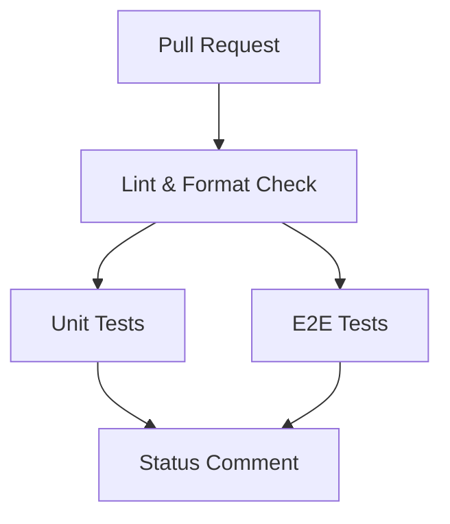

# GitHub Actions CI/CD Setup

Ten dokument opisuje konfigurację GitHub Actions dla projektu, w tym wymagane sekrety i proces uruchomienia.

## Przegląd Workflow

Projekt zawiera workflow `pull-request.yml`, który automatycznie uruchamia się przy każdym Pull Requeście do gałęzi `main` lub `develop`.

### Struktura Workflow

1. **Lint** - Lintowanie i sprawdzanie formatowania kodu
2. **Unit Tests** (równolegle) - Testy jednostkowe z coverage
3. **E2E Tests** (równolegle) - Testy end-to-end z Playwright
4. **Status Comment** - Automatyczny komentarz w PR z podsumowaniem statusu



## Wymagane Sekrety w GitHub

Aby workflow działał poprawnie, musisz skonfigurować następujące sekrety w GitHub:

### Sekrety Supabase

Pobierz z ustawień swojego projektu Supabase (Settings → API):

- `PUBLIC_SUPABASE_URL` - URL twojego projektu Supabase
  - Przykład: `https://xxxxxxxxxxxxx.supabase.co`
  
- `PUBLIC_SUPABASE_ANON_KEY` - Publiczny klucz API (anon/public key)
  - Znajduje się w Supabase → Settings → API → Project API keys → `anon` `public`

### Sekrety do Testów E2E

- `E2E_USERNAME` - Email testowego użytkownika do testów E2E
  - Utwórz dedykowanego użytkownika testowego w swojej bazie Supabase
  - Przykład: `test@example.com`
  
- `E2E_PASSWORD` - Hasło testowego użytkownika
  - Użyj bezpiecznego hasła dla testowego użytkownika

### Opcjonalne Sekrety

- `PORT` - Port dla serwera deweloperskiego (domyślnie: 3001)
  - Jeśli nie ustawiony, zostanie użyta wartość domyślna: 3001

- `CODECOV_TOKEN` - Token do uploadowania coverage na Codecov.io
  - Wymagany tylko jeśli chcesz używać Codecov
  - Pobierz z https://codecov.io/ po zalogowaniu i dodaniu repozytorium

## Jak Dodać Sekrety w GitHub

1. Przejdź do swojego repozytorium na GitHub
2. Kliknij **Settings** → **Secrets and variables** → **Actions**
3. Kliknij **New repository secret**
4. Dodaj każdy sekret:
   - Name: nazwa sekretu (np. `PUBLIC_SUPABASE_URL`)
   - Secret: wartość sekretu
   - Kliknij **Add secret**

## Konfiguracja Środowiska "integration"

Workflow używa środowiska GitHub o nazwie `integration` dla testów E2E. Aby je skonfigurować:

1. Przejdź do **Settings** → **Environments**
2. Kliknij **New environment**
3. Nazwa: `integration`
4. Opcjonalnie możesz dodać:
   - Protection rules (wymagane recenzje przed uruchomieniem)
   - Environment secrets (sekrety specyficzne dla środowiska)

## Utworzenie Użytkownika Testowego E2E

Aby testy E2E działały poprawnie, musisz utworzyć użytkownika testowego w Supabase:

### Opcja 1: Przez Supabase Dashboard

1. Przejdź do Supabase Dashboard
2. Kliknij **Authentication** → **Users**
3. Kliknij **Add user** → **Create new user**
4. Wprowadź:
   - Email: adres email dla testów (np. `e2e-test@yourdomain.com`)
   - Password: bezpieczne hasło
   - Auto Confirm User: ✅ (zaznacz, aby użytkownik był od razu aktywny)
5. Kliknij **Create user**

### Opcja 2: Przez SQL

Możesz również utworzyć użytkownika testowego przez SQL Editor w Supabase:

```sql
-- Utwórz użytkownika testowego (Supabase Auth automatycznie go obsłuży)
-- Upewnij się, że używasz prawdziwego emaila do testów
```

Następnie użyj emaila i hasła tego użytkownika jako wartości dla `E2E_USERNAME` i `E2E_PASSWORD`.

## Testowanie Lokalnie

Aby przetestować workflow lokalnie przed stworzeniem PR:

1. Skopiuj `.env.example` do `.env.test`:
   ```bash
   cp .env.example .env.test
   ```

2. Wypełnij `.env.test` odpowiednimi wartościami

3. Uruchom poszczególne kroki:
   ```bash
   # Linting
   npm run lint
   npm run format:check
   
   # Unit tests z coverage
   npm run test:coverage
   
   # E2E tests
   npm run test:e2e
   ```

## Coverage Reports

Projekt jest skonfigurowany do zbierania coverage z testów jednostkowych:

- **Unit Tests Coverage**: 
  - Reporter: Vitest z `@vitest/coverage-v8`
  - Output: `coverage/` directory
  - Formaty: text, json, html, lcov

Coverage jest automatycznie uploadowany jako artifact w GitHub Actions i można go pobrać po zakończeniu workflow.

### Opcjonalnie: Codecov Integration

Jeśli chcesz używać Codecov do śledzenia coverage:

1. Zarejestruj się na https://codecov.io/
2. Dodaj swoje repozytorium
3. Skopiuj token i dodaj go jako sekret `CODECOV_TOKEN`
4. Coverage będzie automatycznie uploadowany do Codecov przy każdym PR

## Status Comment w PR

Po zakończeniu wszystkich testów, workflow automatycznie doda komentarz do PR z podsumowaniem:

- ✅/❌ Status każdego kroku (Lint, Unit Tests, E2E Tests)
- Link do workflow run
- Informacje o commit i branch

Jeśli komentarz już istnieje, zostanie zaktualizowany zamiast tworzenia nowego.

## Troubleshooting

### E2E Tests Failed: "E2E_USERNAME and E2E_PASSWORD must be set"

Upewnij się, że sekrety `E2E_USERNAME` i `E2E_PASSWORD` są poprawnie ustawione w GitHub Secrets.

### E2E Tests Failed: Login nie działa

1. Sprawdź czy użytkownik testowy istnieje w Supabase Auth
2. Upewnij się, że użytkownik ma status "Confirmed" (nie czeka na weryfikację email)
3. Sprawdź czy `PUBLIC_SUPABASE_URL` i `PUBLIC_SUPABASE_ANON_KEY` są poprawne

### Coverage Upload Failed

Jeśli używasz Codecov:
- Sprawdź czy `CODECOV_TOKEN` jest poprawnie ustawiony
- Upewnij się, że twoje repozytorium jest dodane do Codecov

Jeśli nie używasz Codecov:
- Jest to normalne - step ma flagę `continue-on-error: true`, więc nie blokuje workflow

### "Failed to install Playwright browsers"

Playwright wymaga dodatkowych zależności systemowych. Workflow używa `--with-deps`, które powinno automatycznie zainstalować wszystko. Jeśli to nie działa:
- Sprawdź logi w GitHub Actions
- Może być problem z timeoutem - zwiększ `timeout-minutes` w job e2e-test

## Maintenance

### Aktualizacja Workflow

Workflow znajduje się w `.github/workflows/pull-request.yml`. Możesz dostosować:

- Branches: zmień `branches: [main, develop]` aby uruchamiać na innych gałęziach
- Timeout: zmień `timeout-minutes: 15` dla testów E2E jeśli potrzebują więcej czasu
- Node version: zmień `node-version: '20'` jeśli chcesz używać innej wersji Node.js
- Retries: w `playwright.config.ts` można zmienić `retries: 2` na większą wartość

### Dodanie Nowych Testów

1. **Unit tests**: Dodaj pliki `*.test.ts` w katalogach `__tests__/`
2. **E2E tests**: Dodaj pliki `*.spec.ts` w katalogu `tests/`

Workflow automatycznie wykryje i uruchomi nowe testy.

